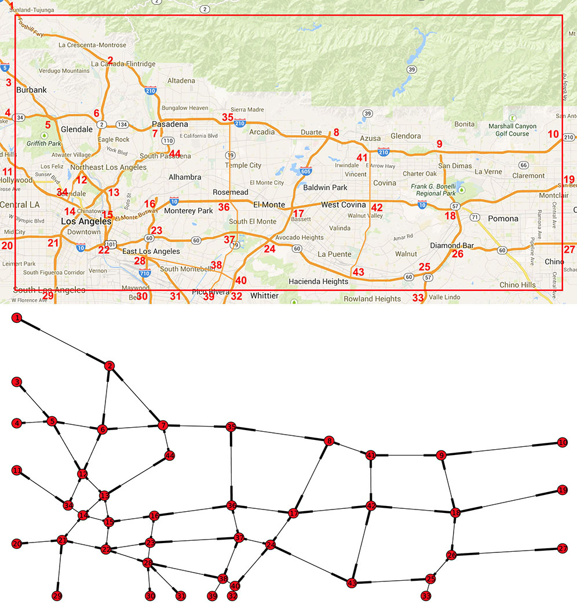

Estimation of user equilibrium in traffic assignment
==========================

Setup
-----
Python dependencies (once only):

    sudo easy_install pip
    pip install cvxopt
    pip install networkx

Running
-----
python test_ue_solver.py
python test_path_solver.py
python test_missing.py

Troubleshooting
--------
...

Network of L.A.
--------

Coordinates for bounding box in L.A.: [-118.328299, 33.984601, -117.68132, 34.255881]

References
--------
chapter 11 of resilient networks: http://faculty.unlv.edu/pushkin/Resilient%20Networks.pdf

chapter 3 of urban networks: http://web.mit.edu/sheffi/www/selectedMedia/sheffi_urban_trans_networks.pdf

Anil’s paper: http://www.nt.ntnu.no/users/skoge/prost/proceedings/acc11/data/papers/1021.pdf