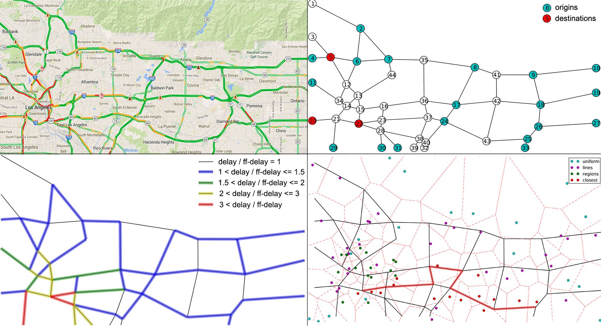
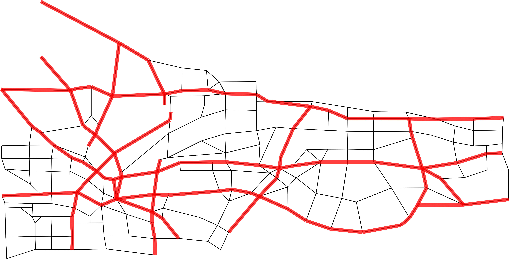

UE computation, latency inference, toll pricing in traffic assignment
==========================

Setup
-----
Python dependencies (once only):

    sudo easy_install pip
    pip install cvxopt
    pip install networkx

Installing GDAL on a Mac: http://www.gis.usu.edu/~chrisg/python/2009/docs/gdal_mac.pdf

Mac OS X frameworks for GDAL: http://www.kyngchaos.com/software:frameworks

Installing PostGIS: http://postgis.net/install

Mac OS X frameworks for PostgreSQL and PosGIS estension: http://www.kyngchaos.com/software/postgres

Tutorial for importing Shapefile into PostgreSQL: http://www.gistutor.com/postgresqlpostgis/4-beginner-postgresqlpostgis-tutorials/18-importing-shapefile-gis-data-into-postgresql.html

Running
-----
python draw_test.py

python read_shps_csv.py

python test_ue_solver.py

python shortest_paths_test.py

python inverse_opt_test.py

python isttt2014_experiments.py

python ecc2015_experiments.py

python toll_pricing_test.py

Troubleshooting
--------
...

Network of L.A.
--------

Coordinates for bounding box in L.A.: [-118.328299, 33.984601, -117.68132, 34.255881]

Clockwise from top left panel: (a) traffic on the network in morning rush hour on 2014-06-12 at 9:14AM from Google Maps, (b) set of origins and destinations in the network, (c) locations of cell tower sampled on the map with associated Voronoi partitioning, (d) delays incurred by the static traffic assignment model.

A mode detailed map of L.A. with 194 nodes and 664 links:

References
--------

Patriksson's book: The Traffic Assignment Problem - Models and Methods

chapter 3 of urban networks: http://web.mit.edu/sheffi/www/selectedMedia/sheffi_urban_trans_networks.pdf

Anil’s paper: http://www.nt.ntnu.no/users/skoge/prost/proceedings/acc11/data/papers/1021.pdf

Toll pricing: http://www.columbia.edu/~ns2224/GT/hearnRamanaTollPricing.pdf

J. Thai, R. Hariss, A. Bayen, "A Multi-Convex approach to Latency Inference and Control in Traffic Equilibria from Sparse data" in preparation

J. Thai, R. Hariss, A. Bayen, "Approximate Bilevel Programming via Pareto Optimization for Imputation and Control of Optimization and Equilibrium models" in preparation
